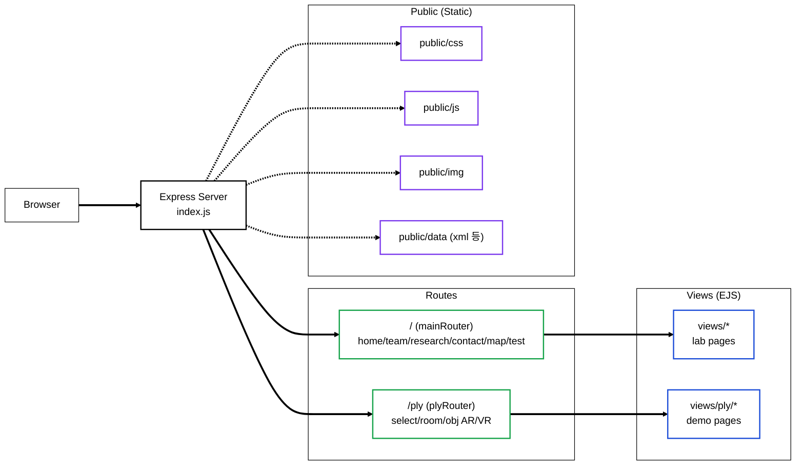

# 🧪 GSC Lab Website (Express + EJS) — Research Lab Web & Demo Hub


> **GSC Lab Website**는 연구실 소개 웹사이트를 제공하면서, 지도 API 실험(Kakao/Naver/Google/VWorld)과  
> **WebXR(AR/VR) 및 3D(PLY) 데모 페이지**를 함께 운영할 수 있도록 구성한 **Node.js(Express) + EJS 기반 서버 프로젝트**입니다.

<br/>

## 📸 Project Showcase
<!-- 실제 배포 URL/스크린샷이 있으면 아래를 교체하세요 -->


* Demo URL : https://gsclab.kr/
<br/>

## 📝 Introduction

연구실 홈페이지는 단순 정적 페이지를 넘어, 연구/데모 성격의 실험 페이지가 늘어나면서  
**라우팅/템플릿/정적 리소스 관리**가 안정적으로 가능한 서버 구성이 필요합니다.

본 프로젝트는 **Express 라우터 구조**로 페이지를 모듈화하고,  
**EJS 템플릿 렌더링**으로 콘텐츠를 관리하며, `public/` 정적 리소스(CSS/JS/이미지/데이터)를 한 번에 서비스합니다.  
또한 `/map`, `/ply`와 같은 실험 섹션을 별도 라우트로 분리하여, 지도 및 XR/3D 데모를 확장 가능하게 설계했습니다.

<br/>

## ✅ Key Features

- **연구실 웹사이트 제공**: 메인/연구/팀/연락처 등 페이지 렌더링(EJS)
- **지도 API 실험 페이지**: Kakao / Naver / Google / VWorld 테스트 라우트 구성
- **3D & WebXR 데모 허브**: PLY/OBJ 뷰어 및 AR/VR 모드 데모 라우팅(`/ply/*`)
- **정적 리소스 서빙**: `public/` 기반 CSS/JS/이미지/데이터 서빙
- **버전 분리 구조**: `current/`(운영형)과 `v2/`(개편형) 폴더로 버전 공존

<br/>

## 🏗 System Architecture



<br/>

## 📁 Project Structure

> `current/`는 운영/메인 버전, `v2/`는 개편(또는 실험) 버전으로 분리되어 있습니다.

```bash
gsc-lab-website-main/
├─ current/                      # 운영형(메인)
│  ├─ index.js                   # Express 서버 엔트리 포인트
│  ├─ package.json               # 의존성/스크립트
│  ├─ src/
│  │  ├─ routes/                 # 라우터 모듈 (mainRouter, plyRouter 등)
│  │  ├─ controllers/            # 컨트롤러 (페이지 렌더링/데이터 처리)
│  │  └─ service/                # 유틸/서비스 모듈(파일 처리 등)
│  ├─ views/                     # EJS 템플릿(서버 렌더링)
│  │  ├─ *.ejs                   # 메인/서브 페이지 템플릿
│  │  └─ ply/                    # 3D/WebXR 데모 템플릿
│  └─ public/                    # 정적 리소스
│     ├─ css/                    # 스타일시트
│     ├─ js/                     # 프론트 스크립트
│     ├─ img/                    # 이미지 리소스
│     └─ data/                   # 데이터 파일(xml 등)
│
└─ v2/                           # 개편/실험 버전(선택)
   ├─ index.js
   ├─ package.json
   ├─ src/
   │  ├─ routes/
   │  ├─ controllers/
   │  └─ service/
   ├─ views/
   └─ public/
```

<br/>

## 🛠 Tech Stack

| Category | Technology | Description |
| --- | --- | --- |
| **Runtime** | Node.js | Express 서버 실행 런타임 |
| **Framework** | Express | 라우팅/미들웨어 구성, 정적 파일 서빙 |
| **Template Engine** | EJS | 서버 사이드 렌더링(SSR) 기반 페이지 템플릿 |
| **Static Assets** | HTML/CSS/JS | `public/` 폴더 기반 정적 리소스 제공 |
| **3D / XR Demos** | WebXR (AR/VR) + 3D Viewer | `/ply` 라우트에서 AR/VR 모드 및 3D 데모 페이지 제공 |
| **Map Experiments** | Kakao / Naver / Google / VWorld | 지도 API 비교/테스트용 실험 페이지 라우팅 |
| **Deployment (Option)** | Docker / Reverse Proxy | 컨테이너 배포 및 Nginx 연동(운영 환경에서 권장) |

<br/>

## 📂 Implementation Details

### 1. Server Bootstrapping (Express Entry)
- `index.js`에서 Express 앱을 초기화하고, **라우터(`/`, `/ply`)를 분리**하여 마운트합니다.
- `public/`를 정적 리소스로 서빙하여 CSS/JS/이미지를 일괄 제공하도록 구성합니다.

### 2. Routing (mainRouter / plyRouter)
- `mainRouter`: 연구실 메인/팀/연구/연락처/지도 테스트 등의 **일반 페이지 라우팅**
- `plyRouter`: **3D(PLY/OBJ) 및 WebXR(AR/VR) 데모**를 위한 라우팅 허브

### 3. Template Rendering (EJS Views)
- `views/` 아래에 페이지 템플릿을 구성하고, 컨트롤러에서 필요한 데이터를 주입해 렌더링합니다.
- `views/ply/`를 별도 디렉토리로 두어 데모 페이지를 모듈화합니다.

### 4. Static Resource Management
- `public/css`, `public/js`, `public/img`, `public/data`로 리소스를 분리해 관리합니다.
- 데모/지도 실험용 데이터(XML 등)가 필요한 경우 `public/data`에서 제공하도록 구성합니다.

### 5. Version Split (current / v2)
- `current/`를 운영/메인 버전으로 유지하면서, `v2/`에서 레이아웃/구성 개편을 병행할 수 있게 분리합니다.

<br/>

## 🧩 What I Built (기술 구현 요약)
- **Express 기반 서버 구조 설계**: 엔트리/라우터/컨트롤러 분리로 유지보수성 강화
- **EJS 템플릿 기반 페이지 렌더링**: 연구실 콘텐츠를 템플릿화해 업데이트 비용 절감
- **정적 리소스 배포 체계화**: public 구조 정리로 배포/운영 안정성 확보
- **실험 페이지 허브 구성**: 지도 API 테스트 + WebXR/3D 데모를 단일 서버에서 통합 운영

<br/>

## 🚀 How to Run

### 1) current 실행
```bash
cd gsc-lab-website-main/current
npm install
node index.js
```

### 2) v2 실행(선택)
```bash
cd gsc-lab-website-main/v2
npm install
node index.js
```
* 기본 포트는 프로젝트 설정에 따라 다를 수 있습니다(예: 8888).
* 실행 후 브라우저에서 http://localhost:<PORT> 로 접속합니다.

<br/>


## ⚠️ Notes
서버 경로가 특정 환경에 절대경로로 고정되어 있다면, 배포/이식성을 위해 path.join(__dirname, ...) 형태의 상대경로 사용을 권장합니다.
운영 배포는 Reverse Proxy(Nginx) + HTTPS 구성을 권장합니다.

<br/>

## ⚖️ License

**Copyright (c) Soongsil University. All Rights Reserved.**

This project was developed as part of a curriculum or research at **Soongsil University**.
The intellectual property and copyright of this software belong to **Soongsil University**.
Unauthorized commercial use or distribution is prohibited.

